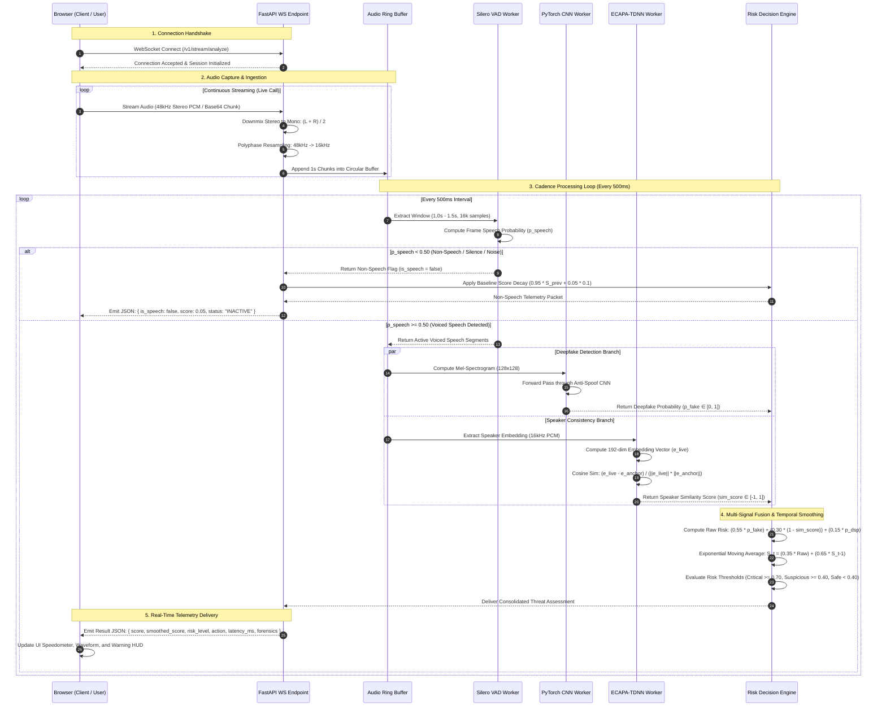

# True Tone: Detailed End-to-End Architecture & Streaming Flowchart

This document provides the complete, exhaustive specification and visual flowchart of the real-time audio interception, VAD, feature extraction, PyTorch CNN deepfake scoring, ECAPA-TDNN speaker verification, and Risk Engine pipeline.

---

## 1. Comprehensive System Flowchart (Mermaid)

```mermaid
flowchart TD
    %% SUBGRAPH 1: CLIENT BROWSER
    subgraph Client["1. Client Tier (Browser / Endpoint Device)"]
        A1["User Speaks into Microphone"] --> A2["MediaStream API (getUserMedia)"]
        A2 --> A3["MediaRecorder / AudioWorklet Node<br/>Format: 48 kHz, Stereo (2 Ch), Float32 / Int16 PCM"]
        A3 --> A4["Establish WebSocket Connection<br/>Target: ws://host:port/v1/stream/analyze"]
        A4 --> A5["Stream Continuous Audio Chunks<br/>Binary PCM / Base64 JSON (every 100-250ms)"]
        A15["Receive Threat Telemetry JSON<br/>via WebSocket"] --> A16["Update UI HUD:<br/>• Speedometer Gauge<br/>• Live Waveform & Spectrogram<br/>• Threat Alert Banner (Safe / Suspicious / Critical)"]
    end

    %% SUBGRAPH 2: FASTAPI SERVER & INGESTION
    subgraph Ingestion["2. Ingestion & Preprocessing Tier (FastAPI Server)"]
        A5 --> B1["FastAPI WebSocket Handler<br/>(/v1/stream/analyze)"]
        B1 --> B2["Payload Decapsulation<br/>Binary Buffer / Base64 Decode"]
        B2 --> B3["Channel Downmixing<br/>Stereo to Mono: (L + R) / 2"]
        B3 --> B4["Polyphase / Sinc Resampler<br/>Resample: 48,000 Hz -> 16,000 Hz"]
        B4 --> B5["PCM Normalization<br/>Scale to Float32 [-1.0, 1.0]"]
    end

    %% SUBGRAPH 3: STREAM BUFFERING
    subgraph Buffering["3. Temporal Buffer Tier (Audio Ring Buffer)"]
        B5 --> C1["Append Audio Chunks into Circular Ring Buffer<br/>Capacity: 3.0 - 5.0 Seconds of Audio"]
        C1 --> C2["Timer / Cadence Controller<br/>Every 500 ms Interval (Sliding Hop)"]
        C2 --> C3["Extract Sliding Window Chunk<br/>Window Size: 1.0s - 1.5s (16,000 - 24,000 samples)"]
    end

    %% SUBGRAPH 4: VAD TIER
    subgraph VAD["4. Voice Activity Detection Tier (Silero VAD Worker)"]
        C3 --> D1["Silero VAD Inference Engine<br/>Model: Silero VAD (ONNX / TorchScript)"]
        D1 --> D2["Compute Frame Speech Probability:<br/>p_speech ∈ [0.0, 1.0]"]
        D2 --> D3{"Speech Detected?<br/>p_speech >= 0.50"}
        
        %% Non-speech path
        D3 -- "NO (Silence / Line Noise / Dial-tone)" --> D4["Bypass Deep Learning Workers<br/>Emit Non-Speech Status"]
        D4 --> D5["Session Score Decay<br/>S_t = 0.95 * S_prev + 0.05 * Baseline"]
        D5 --> F5["Format Inactive Telemetry JSON"]
        
        %% Voiced speech path
        D3 -- "YES (Active Speech Segment)" --> D6["Segment & Trim Active Speech Frames<br/>Remove Trailing / Leading Silence"]
    end

    %% SUBGRAPH 5: PYTORCH INFERENCE TIER
    subgraph PyTorch["5. Deep Learning Inference Tier (PyTorch Worker)"]
        D6 --> E1["Branch A: Mel-Spectrogram Extraction<br/>STFT: n_fft=512, hop_length=160, 128 Mel Bins<br/>Output Tensor: (1, 1, 128, 128)"]
        D6 --> E2["Branch B: Speaker Embedding Extraction<br/>Raw 16kHz Waveform -> ECAPA-TDNN"]
        
        %% Deepfake CNN Branch
        E1 --> E3["Deepfake CNN Classifier Forward Pass<br/>Architecture: LCNN / ResNet with MFM activations"]
        E3 --> E4["Compute Deepfake Probability:<br/>p_fake ∈ [0.0, 1.0]"]
        
        %% Speaker Verification Branch
        E2 --> E5["ECAPA-TDNN Forward Pass<br/>Generates 192-dim Speaker Embedding: e_live"]
        E5 --> E6{"Session Anchor Exists?"}
        E6 -- "NO (First Voiced Chunk)" --> E7["Register Anchor Embedding:<br/>e_anchor = e_live"]
        E7 --> E8["Set Baseline sim_score = 1.0"]
        E6 -- "YES (Subsequent Chunks)" --> E9["Calculate Cosine Similarity:<br/>sim_score = (e_live · e_anchor) / (||e_live|| * ||e_anchor||)"]
        E9 --> E10["Cosine Distance Risk:<br/>p_drift = 1.0 - max(0.0, sim_score)"]
    end

    %% SUBGRAPH 6: RISK ENGINE & FUSION
    subgraph RiskEngine["6. Risk Decision & Alerting Engine"]
        E4 --> F1["Multi-Signal Fusion Module"]
        E8 --> F1
        E10 --> F1
        
        F1 --> F2["Compute Composite Raw Risk Score:<br/>Raw_Risk = (w_fake * p_fake) + (w_drift * p_drift) + (w_dsp * p_dsp)<br/>Weights: w_fake=0.55, w_drift=0.30, w_dsp=0.15"]
        
        F2 --> F3["Temporal Exponential Moving Average (EMA):<br/>S_t = (alpha * Raw_Risk) + ((1 - alpha) * S_t-1)<br/>Smoothing Parameter alpha = 0.35"]
        
        F3 --> F4{"Threshold Classification"}
        
        F4 -- "S_t >= 0.70" --> G1["State: CRITICAL SPOOF DETECTED<br/>Action: TRIGGER IN-CALL WARNING / BLOCK TRANSACTION<br/>Level: CRITICAL (Red)"]
        F4 -- "0.40 <= S_t < 0.70" --> G2["State: HIGH SUSPICION<br/>Action: SILENT SECURITY ALERT / STEP-UP MFA<br/>Level: SUSPICIOUS (Amber)"]
        F4 -- "S_t < 0.40" --> G3["State: VERIFIED BONAFIDE CALLER<br/>Action: ALLOW STREAM / VERIFIED HUMAN<br/>Level: SAFE (Green)"]
        
        G1 --> F5["Construct Comprehensive Result JSON:<br/>{ score, smoothed_score, risk_level, action, latency_ms, forensics }"]
        G2 --> F5
        G3 --> F5
        
        F5 --> F6["Serialize JSON to WebSocket"]
    end

    %% FEEDBACK LOOP TO BROWSER
    F6 --> A15
```

---

## 2. Exhaustive Chronological Sequence Diagram (Mermaid)

---

## 3. Detailed Component & Data-Flow Matrix

| Step | Entity | Input | Operation / Transformation | Output | Execution Budget |
| :--- | :--- | :--- | :--- | :--- | :--- |
| **1** | **Browser** | Microphone audio | `MediaRecorder` captures 48kHz stereo stream | Continuous PCM byte buffers | ~100ms |
| **2** | **FastAPI WS** | 48kHz Stereo bytes | Average channels $(L+R)/2$ and resample via polyphase filter | 16kHz Mono float32 array | < 5ms |
| **3** | **Audio Buffer** | 16kHz Mono stream | Append into circular ring buffer; every 500ms extract 1.0–1.5s window | Windowed audio slice (16k–24k samples) | < 1ms |
| **4** | **Silero VAD** | 16kHz audio slice | Neural Voice Activity Detection; check if $p_{\text{speech}} \ge 0.50$ | Boolean `is_speech` + trimmed active segments | ~4–8ms |
| **5A** | **Mel-Spectrogram** | Active speech segment | STFT with $N_{\text{fft}}=512$, hop=160, 128 triangular Mel filters | Normalized tensor: `(1, 1, 128, 128)` | ~3ms |
| **5B** | **PyTorch CNN** | `(1, 1, 128, 128)` | Forward pass through LCNN/ResNet with Max-Feature-Map activation | Deepfake probability $p_{\text{fake}} \in [0.0, 1.0]$ | ~12–25ms |
| **5C** | **ECAPA-TDNN** | Active speech segment | Frame-level TDNN with channel & context attention | 192-dim vector $\mathbf{e}_{\text{live}}$ + cosine similarity | ~15–30ms |
| **6** | **Risk Engine** | $p_{\text{fake}}$, $\text{sim\_score}$, DSP | Multi-signal weighted fusion + EMA temporal smoothing ($S_t$) | `SAFE`, `SUSPICIOUS`, or `CRITICAL` decision | < 1ms |
| **7** | **WebSocket** | Risk Decision object | Serialization to JSON format; broadcast to connected client | JSON payload | < 2ms |
| **8** | **Browser HUD** | Result JSON | DOM render: update canvas visualizer, meter dials, and alert banner | Interactive visual feedback | Immediate |
