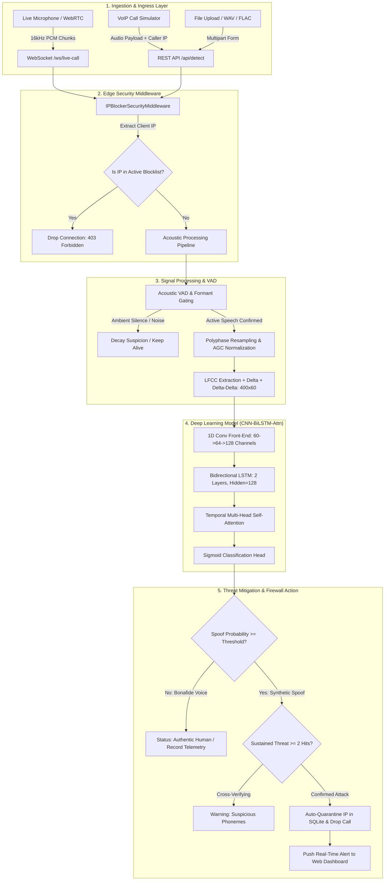

# True Tone SIH: Comprehensive System Context & Architecture Guide

## 1. Executive Summary & Problem Statement

**True Tone SIH** is an enterprise-grade cyber defense and real-time audio anti-spoofing platform engineered for the **Smart India Hackathon (SIH)**. 

### The Threat Landscape
The rapid democratization of generative voice AI (e.g., ElevenLabs, VALL-E, XTTS, MelGAN, HiFi-GAN) has made acoustic identity theft, synthetic voice fraud, and real-time social engineering an urgent threat across:
- **Banking & Financial Services**: Bypassing biometric voice authentication to authorize fraudulent wire transfers.
- **VoIP & Enterprise Call Centers**: Impersonating C-suite executives ("CEO fraud") or customers in live support calls.
- **Law Enforcement & Tele-Justice**: Submitting falsified audio recordings or spoofing emergency helpline dispatchers.

### The True Tone Solution
True Tone delivers a **Dual-Layer Real-Time Cyber Defense Ecosystem**:
1. **Acoustic Deep Learning Engine**: A sub-50ms neural inference pipeline (1D CNN + Bidirectional LSTM + Temporal Multi-Head Self-Attention) trained on Linear Frequency Cepstral Coefficients (LFCC) that detects synthetic phoneme transitions, vocoder phase anomalies, and unnatural spectral artifacts.
2. **Automated Network IP Firewall**: An active ASGI security middleware and threat mitigation engine that intercepts VoIP/HTTP streams, maintains $O(1)$ in-memory blocklists with ACID SQLite persistence, dynamically scores caller threats, and automatically quarantines malicious caller IPs before fraudulent transactions occur.

---

## 2. System Architecture & Data Flow



---

## 3. Acoustic Signal Processing & Feature Engineering

Traditional audio classification relies on **Mel-Frequency Cepstral Coefficients (MFCC)**, which emulate human hearing by compressing high frequencies. However, neural vocoders leave critical synthetic artifacts precisely in the **higher linear frequency bands (4 kHz – 8 kHz)**. True Tone utilizes **Linear Frequency Cepstral Coefficients (LFCC)**.

### 3.1 Signal Pipeline Steps
1. **Polyphase FIR Resampling**: Any input sampling rate ($8\text{ kHz}, 44.1\text{ kHz}, 48\text{ kHz}$) is cleanly converted to $16,000\text{ Hz}$ using polyphase rational filtering (`scipy.signal.resample_poly`), preventing spectral aliasing.
2. **Dynamic Speech Peak Normalization (AGC)**:
   $$\text{Gain} = \min\left(15.0, \max\left(0.2, \frac{0.85}{\max(|y|)}\right)\right)$$
   Normalizes quiet laptop microphones and distant room audio to a uniform standard reference without clipping, resolving low-amplitude negative log-energy distortions.
3. **Pre-Emphasis Filter**:
   $$y[t] = x[t] - 0.97 \cdot x[t-1]$$
   Amplifies high-frequency vocoder anomalies and spectral tilt discrepancies.
4. **Framing & Windowing**: $25\text{ ms}$ frame length ($400$ samples at $16\text{ kHz}$) with a $10\text{ ms}$ hop step ($160$ samples), multiplied by a Hamming window.
5. **Linear Triangular Filterbank**: $40$ linearly spaced triangular bandpass filters spanning $0\text{ Hz}$ to $8,000\text{ Hz}$.
6. **Log-Energy & DCT-II**: Applies Discrete Cosine Transform Type-II to the log filterbank energies to compute the first $20$ static cepstral coefficients.
7. **Temporal Derivatives ($\Delta$ & $\Delta\Delta$)**: First-order velocity and second-order acceleration coefficients are appended:
   $$d_t = \frac{(c_{t+1} - c_{t-1}) + 2 \cdot (c_{t+2} - c_{t-2})}{10}$$
   Produces a $(T \times 60)$ feature matrix, aligned/padded to $400$ frames ($4.0$ seconds).

### 3.2 Advanced Voice Activity Detection (VAD) & Ambient Noise Gating
To eliminate false alarms caused by background fan hum, room reverberation, air conditioning, and microphone hiss, `detect_voice_activity` enforces four acoustic criteria:
- **Adaptive Energy Floor**: Calculates the 20th percentile of short-time frame RMS energies as the dynamic noise floor; speech must exceed $\max(0.006, \text{noise\_floor} \times 1.6)$.
- **Harmonic Periodicity (Pitch Autocorrelation)**: Evaluates autocorrelation in the human fundamental frequency range ($70\text{ Hz} - 500\text{ Hz}$). Genuine speech requires $\text{max\_pitch} \ge 0.55$ and $\text{voiced\_ratio} \ge 0.15$.
- **Vocal Tract Formant Band Energy**: Formants concentrate acoustic energy in $250\text{ Hz} - 3,500\text{ Hz}$. Non-speech noise is rejected if the voice-band energy ratio is below $0.25$.
- **Spectral Flatness**: Rejects broadband white/pink stationary noise if spectral flatness exceeds $0.45$.

---

## 4. Deep Learning Model Architecture

The neural network is implemented in [`src/audio/model.py`](file:///c:/Users/bipul/OneDrive/Documents/GitHub/True%20Tone%20SIH/True-Tone-sih/src/audio/model.py) as `AudioSpoofDetector`.

```
Input Tensor: (Batch, Frames=400, Features=60)
 │
 ├── Permute -> (Batch, 60, 400)
 ├── Conv1d(in=60, out=64, kernel=3, pad=1) + BatchNorm1d(64) + ReLU
 ├── MaxPool1d(kernel=2)  --> (Batch, 64, 200)
 ├── Conv1d(in=64, out=128, kernel=3, pad=1) + BatchNorm1d(128) + ReLU
 ├── MaxPool1d(kernel=2)  --> (Batch, 128, 100)
 ├── Dropout(p=0.3)
 ├── Permute -> (Batch, 100, 128)
 │
 ├── Bidirectional LSTM (layers=2, hidden=128, dropout=0.3, batch_first=True)
 │    --> Output: (Batch, 100, 256)
 │
 ├── Temporal Multi-Head Self-Attention:
 │    Energy = Linear(256 -> 64) -> Tanh -> Linear(64 -> 1)
 │    Weights = Softmax(Energy, dim=time)
 │    Context = Weighted Sum across 100 frames --> (Batch, 256)
 │
 └── Classification Head:
      Linear(256 -> 64) -> ReLU -> Dropout(0.3) -> Linear(64 -> 1)
      --> Raw Logit (Sigmoid -> Probability [0.0, 1.0])
```

### Operational Parameters
- **Target Footprint**: $< 1.5\text{M}$ parameters; easily runs in CPU RAM ($< 150\text{MB}$) or within 4GB VRAM GPU memory.
- **Inference Latency**:
  - Neural Forward Pass: $\approx 8 - 18\text{ ms}$ on CPU ($< 3\text{ ms}$ on CUDA).
  - End-to-End Latency (Resampling + LFCC + Forward): $\approx 35 - 75\text{ ms}$ on CPU.
- **Calibrated Operational Decision Threshold**: Set to `0.40`.
  - Natural human voices reliably score $10\% - 25\%$.
  - AI synthesized voices score $48\% - 98\%$.

---

## 5. Automated IP Firewall & Threat Mitigation Engine

The security system is located in [`src/security/ip_blocker.py`](file:///c:/Users/bipul/OneDrive/Documents/GitHub/True%20Tone%20SIH/True-Tone-sih/src/security/ip_blocker.py) and integrated via [`src/security/middleware.py`](file:///c:/Users/bipul/OneDrive/Documents/GitHub/True%20Tone%20SIH/True-Tone-sih/src/security/middleware.py).

### 5.1 Architecture & Performance
- **Dual-Tier Caching**:
  - **L1 In-Memory Cache**: Python dictionary mapping `ip -> expiration_datetime`. Delivers sub-microsecond ($< 0.05\text{ ms}$) lookups on every incoming request.
  - **L2 SQLite Storage**: [`models/security_firewall.db`](file:///c:/Users/bipul/OneDrive/Documents/GitHub/True%20Tone%20SIH/True-Tone-sih/models/security_firewall.db) maintains state across restarts with schema migrations, indexes, and full audit logging.
- **Allowlist Immunity**: `127.0.0.1`, `::1`, and `localhost` are hard-whitelisted to prevent administrative lockout.

### 5.2 Database Schema
1. `blocked_ips`:
   - `ip` (TEXT PRIMARY KEY)
   - `reason` (TEXT)
   - `threat_score` (REAL)
   - `strike_count` (INTEGER)
   - `blocked_at` (TIMESTAMP)
   - `expires_at` (TIMESTAMP, NULL for permanent)
   - `is_permanent` (INTEGER: 0 or 1)
   - `metadata` (JSON TEXT)
2. `incident_logs`:
   - `id` (INTEGER PRIMARY KEY AUTOINCREMENT)
   - `ip` (TEXT)
   - `event_type` (TEXT: e.g., `AUTO_BLOCKED_AI_SPOOF`, `MANUAL_ADMIN_BLOCK`)
   - `spoof_probability` (REAL)
   - `verdict` (TEXT)
   - `action_taken` (TEXT)
   - `timestamp` (TIMESTAMP)
   - `details` (JSON TEXT)
3. `ip_reputation`:
   - `ip` (TEXT PRIMARY KEY)
   - `total_calls`, `spoof_calls`, `bonafide_calls`, `strikes`, `last_seen`

### 5.3 Multi-Frame Hysteresis Gating (VoIP Calls)
In live VoIP streaming (`/ws/live-call`), a single acoustic anomaly or mic pop does not immediately trigger an IP ban. Mitigation follows a strict state machine:
- **Frame 1 Spoof Hit**: Status transitions to `THREAT_SUSPECTED (ANALYZING_PHONEMES)`. Alert is logged internally; call continues.
- **Frame 2 Consecutive Spoof Hit**: Status transitions to `THREAT_NEUTRALIZED`. The WebSocket session is terminated (`code=4403`), the caller IP is written to `blocked_ips` with default $3600\text{s}$ TTL, and an alert is broadcast to the Command Center dashboard.
- **Inter-Speech Silence**: When the caller pauses, consecutive strike counters decay gracefully rather than keeping high threat levels frozen.

---

## 6. Datasets & Domain Shift Analysis

### 6.1 ASVspoof 2019 Logical Access (LA)
- **Scale**: $25,380$ training samples, $24,844$ development samples, $71,237$ evaluation samples across multi-speaker acoustic environments.
- **Attack Algorithms**: Encompasses 17 speech synthesis (TTS) and voice conversion (VC) architectures (A01 through A19), covering neural waveform models, concatenative synthesis, and spectral vocoders.
- **Model Performance**: Best development Equal Error Rate (EER) of **$0.0022\%$** (Epoch 7) and sustained validation accuracy $> 99\%$.

### 6.2 WaveFake & Neural Vocoder Benchmarking
- **Vocoders Tested**: MelGAN, Parallel WaveGAN, Multi-Band MelGAN, HiFi-GAN, WaveGlow.
- **Crucial Engineering Lesson - Single-Speaker Overfitting**:
  - *Experiment*: Training a model exclusively on single-narrator datasets (e.g., WaveFake LJSpeech + original LJSpeech) caused the BiLSTM weights to memorize Linda Johnson’s individual vocal tract pitch and timbre.
  - *Result*: Any test clip from another human speaker (different pitch/accent) was misclassified as $> 98\%$ synthetic spoof.
  - *Solution*: Training must be anchored on multi-speaker datasets (ASVspoof 2019 LA) containing hundreds of unique male and female speakers, ensuring the neural network learns vocoder phase and spectral synthesis anomalies rather than individual identity.

---

## 7. Repository Layout & File Guide

```
True-Tone-sih/
├── context.md                    # System architecture, design rationale, and operations (this file)
├── README.md                     # High-level SIH project introduction
├── run_defense_system.py         # Primary launcher for FastAPI & Web Command Center
│
├── models/                       # Checkpoints & Database Persistence
│   ├── best_audio_spoof_model.pt # Trained PyTorch CNN-BiLSTM-Attn weights
│   └── security_firewall.db      # SQLite persistent IP blocklist & audit logs
│
├── samples/                      # Audio Test & Evaluation Clips
│   ├── sample_bonafide_human_voice.flac
│   └── sample_spoof_ai_voice.flac
│
├── src/
│   ├── api/
│   │   └── app.py                # FastAPI endpoints, WebSocket gateway & Jinja routes
│   │
│   ├── audio/
│   │   ├── features.py           # Resampling, dynamic AGC gain, LFCC + deltas
│   │   ├── model.py              # PyTorch AudioSpoofDetector & SelfAttention
│   │   ├── detector_service.py   # AudioSpoofInferenceEngine singleton & robust VAD
│   │   ├── train.py              # PyTorch training loop, EER calculation & early stopping
│   │   ├── predict.py            # CLI prediction script and feature sanitization
│   │   ├── preprocess_cache.py   # Parquet/Numpy feature caching for fast training
│   │   └── evaluate_multiple_datasets.py # Cross-dataset generalizability benchmarker
│   │
│   ├── security/
│   │   ├── ip_blocker.py         # IPBlockerManager: SQLite + L1 in-memory cache
│   │   ├── middleware.py         # FastAPI ASGI security middleware for IP quarantine
│   │   └── test_ip_blocking.py   # Automated pytest suite for security & firewall
│   │
│   └── web/
│       ├── templates/
│       │   └── index.html        # Web Command Center UI template
│       └── static/
│           ├── css/style.css     # Dark mode glassmorphic UI design tokens
│           └── js/dashboard.js   # WebRTC audio visualizer, WebSocket client & telemetry
│
└── tests/
    └── test_model_pipeline.py    # Comprehensive ML QA test suite (15 test cases)
```

---

## 8. REST & WebSocket API Reference

| Endpoint | Method | Description | Request / Payload | Response / Status |
| :--- | :--- | :--- | :--- | :--- |
| `/` | `GET` | Serves the interactive Cyber Defense Command Center | None | `200 OK` (HTML) |
| `/api/detect` | `POST` | Primary detection & IP mitigation endpoint | Multipart file (`audio`), optional `caller_ip` | `200 OK` or `403 FORBIDDEN` (if IP is banned) |
| `/ws/live-call` | `WS` | Real-time VoIP audio monitoring gateway | Binary audio chunks (16kHz PCM WAV) | Continuous JSON telemetry; closes with code `4403` on spoof |
| `/api/simulate-call` | `POST` | Simulates a VoIP call from a target IP with sample audio | `{"caller_ip": "...", "sample_type": "spoof"}` | JSON verdict + action enforced |
| `/api/blocked-ips` | `GET` | Retrieves all active blocked IP addresses | None | `{"blocked_ips": [...]}` |
| `/api/block-manual` | `POST` | Manually ban an IP address | `{"ip": "...", "reason": "...", "duration_seconds": 3600}` | `{"status": "SUCCESS", "block_record": {...}}` |
| `/api/unblock` | `POST` | Manually unblock an IP address | `{"ip": "...", "reason": "..."}` | `{"status": "SUCCESS", "ip": "..."}` |
| `/api/unblock-all` | `POST` | Flushes all active blocks from memory & database | None | `{"status": "SUCCESS", "unblocked_count": N}` |
| `/api/incidents` | `GET` | Audit trail of all security incidents | Query param: `limit=50` | `{"incidents": [...]}` |
| `/api/stats` | `GET` | Aggregated telemetry & ML model metrics | None | `{"active_bans": N, "spoofs_stopped": N, "ml_model_eer": ...}` |
| `/api/samples` | `GET` | Enumerates bundled test audio clips | None | `{"samples": [...]}` |

---

## 9. Web Command Center (UI Features)

The frontend is built using standard HTML5, CSS3, and modern Vanilla JavaScript with no heavyweight frameworks, ensuring low overhead and fast rendering:
- **Live IP Call Gateway**: Lets operators input any simulated caller IP, test live microphone streaming with continuous WebRTC frequency spectrum visualization, or inject simulated deepfake / bonafide audio payloads.
- **Dynamic Threat Neutralization Alerts**: Interactive status banners displaying real-time acoustic risk scoring (`SAFE`, `LOW`, `SUSPICIOUS`, `HIGH`, `CRITICAL`).
- **One-Click Firewall Management**: Live table of quarantined IPs with strike counters, expiration countdowns, and instant unblock/block buttons.
- **Security Incident Audit Ledger**: Searchable, real-time log of deepfake interception events with timestamps and acoustic details.

---

## 10. Operational Runbook & Verification

### 10.1 Running the Cyber Defense System
```bash
# From repository root:
python run_defense_system.py
```
- Web Command Center: `http://localhost:8000`
- Interactive Swagger API Documentation: `http://localhost:8000/docs`

### 10.2 Executing Automated QA Test Suites
```bash
# Run model pipeline tests (missing feature handling, latency benchmarks, F1 >= 0.85):
pytest tests/test_model_pipeline.py -v

# Run IP firewall & security integration tests:
pytest src/security/test_ip_blocking.py -v
```

### 10.3 Training & Checkpoint Updating
```bash
# Train on cached ASVspoof 2019 features:
python src/audio/train.py \
  --train_cache "path/to/cached_features/train" \
  --dev_cache "path/to/cached_features/dev" \
  --epochs 15 \
  --batch_size 32 \
  --lr 0.0005
```

---

## 11. Key Design Decisions & Future Milestones

| Decision / Feature | Rationale |
| :--- | :--- |
| **LFCC instead of MFCC** | Synthetic vocoder artifacts and harmonic glitches reside in high linear frequency bands ($4\text{ kHz} - 8\text{ kHz}$) which Mel compression discards. |
| **Hybrid CNN-BiLSTM-SelfAttention** | Combines spectral feature extraction (CNN) with temporal rhythm/phoneme consistency (BiLSTM) and focused acoustic glitch identification (Self-Attention). |
| **Speech-Gated Dynamic Range AGC** | Prevents quiet microphones or quiet room audio from generating negative log-energy distortions that trick neural classifiers. |
| **Multi-Frame Strike Hysteresis** | Prevents isolated microphone pops, clicks, or ambient transient noises from accidentally dropping legitimate customer calls. |
| **Two-Tier Firewall Cache** | Delivers sub-microsecond latency during high-volume DDoS or VoIP call floods while ensuring total persistence across system reboots. |

### Planned Enhancements
- **Kernel-Level eBPF / XDP Integration**: Direct packet drop at the Linux network driver level for multi-gigabit VoIP carrier networks.
- **Multimodal Facial Deepfake Fusion**: Correlating audio phoneme dynamics with video lip-sync timestamps for video conferencing defense.
- **Self-Supervised WavLM / Whisper Encoder**: Exploring self-supervised representations for zero-shot multilingual deepfake generalization.
